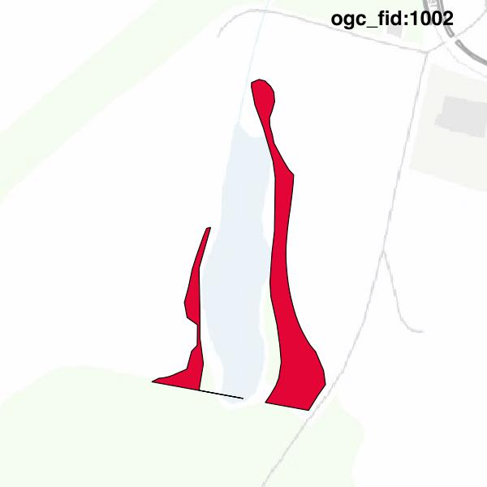

#Report on feature with OGC_FID=1002
##Original geometry

| ogc_fid |  beregnet_areal  | antal_punkter | antal_geometrier |    type    |
|---------|------------------|---------------|------------------|------------|
|    1002 | 977.157237613919 |            92 |                1 | ST_Polygon|

##Geometry with buffer 0

| ogc_fid |  beregnet_areal  | antal_punkter | antal_geometrier |      type       |
|---------|------------------|---------------|------------------|-----------------|
|    1002 | 977.229546568699 |            94 |                2 | ST_MultiPolygon|

