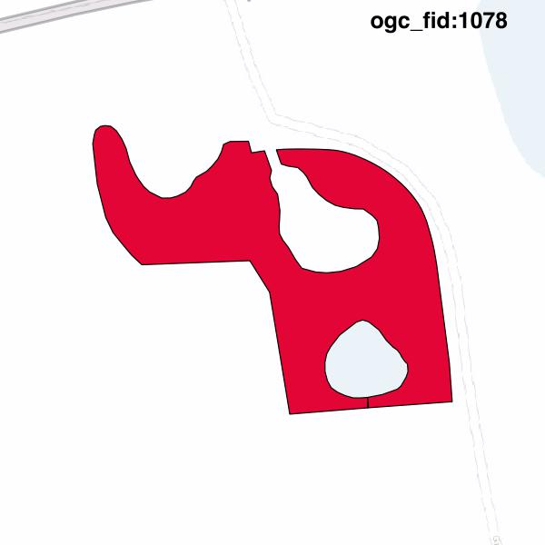

#Report on feature with OGC_FID=1078
##Original geometry

| ogc_fid |  beregnet_areal  | antal_punkter | antal_geometrier |    type    |
|---------|------------------|---------------|------------------|------------|
|    1078 | 2554.69653972492 |           146 |                1 | ST_Polygon|

##Geometry with buffer 0

| ogc_fid |  beregnet_areal  | antal_punkter | antal_geometrier |    type    |
|---------|------------------|---------------|------------------|------------|
|    1078 | 2554.69653972492 |           145 |                1 | ST_Polygon|

