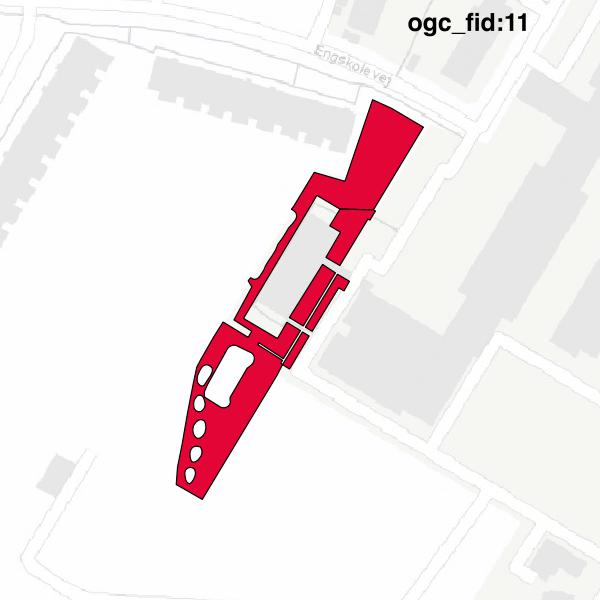

#Report on feature with OGC_FID=11
##Original geometry

| ogc_fid |  beregnet_areal  | antal_punkter | antal_geometrier |      type       |
|---------|------------------|---------------|------------------|-----------------|
|      11 | 2148.74538601716 |           184 |                4 | ST_MultiPolygon|

[highres](https://raw.githubusercontent.com/Septima/herlev/master/images/11_invalid.jpg)
##Geometry with buffer 0

| ogc_fid |  beregnet_areal  | antal_punkter | antal_geometrier |      type       |
|---------|------------------|---------------|------------------|-----------------|
|      11 | 2148.74538601716 |           182 |                4 | ST_MultiPolygon|

[highres](https://raw.githubusercontent.com/Septima/herlev/master/images/11_buffer0_highres.jpg)
