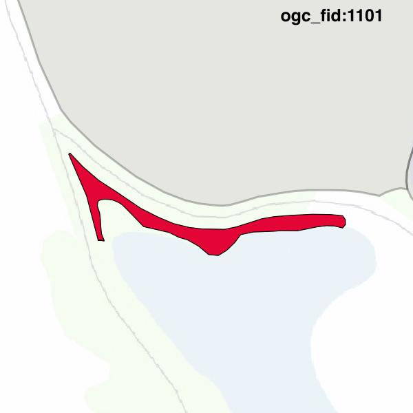

#Report on feature with OGC_FID=1101
##Original geometry

| ogc_fid |  beregnet_areal  | antal_punkter | antal_geometrier |    type    |
|---------|------------------|---------------|------------------|------------|
|    1101 | 210.310287887658 |            62 |                1 | ST_Polygon|

[highres](https://raw.githubusercontent.com/Septima/herlev/master/images/1101_invalid_highres.jpg)
##Geometry with buffer 0

| ogc_fid |  beregnet_areal  | antal_punkter | antal_geometrier |    type    |
|---------|------------------|---------------|------------------|------------|
|    1101 | 210.310287887658 |            60 |                1 | ST_Polygon|

[highres](https://raw.githubusercontent.com/Septima/herlev/master/images/1101_buffer0_highres.jpg)
