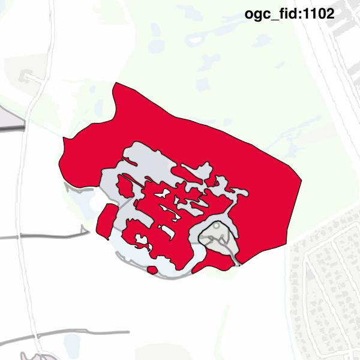
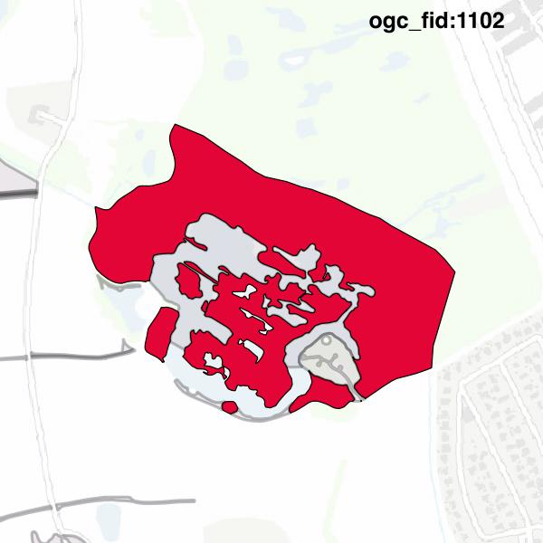

#Report on feature with OGC_FID=1102
##Original geometry

| ogc_fid |  beregnet_areal  | antal_punkter | antal_geometrier |      type       |
|---------|------------------|---------------|------------------|-----------------|
|    1102 | 93928.7348871639 |          1342 |                7 | ST_MultiPolygon|

[highres](https://raw.githubusercontent.com/Septima/herlev/master/images/1102_invalid.jpg)
##Geometry with buffer 0

| ogc_fid |  beregnet_areal  | antal_punkter | antal_geometrier |      type       |
|---------|------------------|---------------|------------------|-----------------|
|    1102 | 93928.7348871639 |          1305 |                8 | ST_MultiPolygon|

[highres](https://raw.githubusercontent.com/Septima/herlev/master/images/1102_buffer0_highres.jpg)
