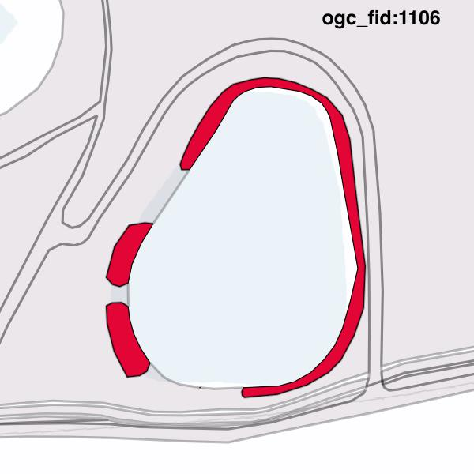

#Report on feature with OGC_FID=1106
##Original geometry

| ogc_fid |  beregnet_areal  | antal_punkter | antal_geometrier |      type       |
|---------|------------------|---------------|------------------|-----------------|
|    1106 | 468.998291213094 |            81 |                4 | ST_MultiPolygon|

[highres](https://raw.githubusercontent.com/Septima/herlev/master/images/1106_invalid_highres.jpg)
##Geometry with buffer 0

| ogc_fid |  beregnet_areal  | antal_punkter | antal_geometrier |      type       |
|---------|------------------|---------------|------------------|-----------------|
|    1106 | 468.998291213094 |            77 |                3 | ST_MultiPolygon|

[highres](https://raw.githubusercontent.com/Septima/herlev/master/images/1106_buffer0_highres.jpg)
