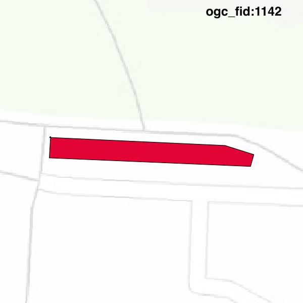
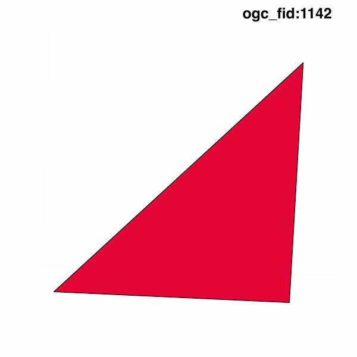

#Report on feature with OGC_FID=1142
##Original geometry

| ogc_fid |  beregnet_areal  | antal_punkter | antal_geometrier |    type    |
|---------|------------------|---------------|------------------|------------|
|    1142 | 72.2416499926473 |             7 |                1 | ST_Polygon|

[highres](https://raw.githubusercontent.com/Septima/herlev/master/images/1142_invalid_highres.jpg)
##Geometry with buffer 0

| ogc_fid |   beregnet_areal    | antal_punkter | antal_geometrier |    type    |
|---------|---------------------|---------------|------------------|------------|
|    1142 | 0.00847219445826656 |             4 |                1 | ST_Polygon|

[highres](https://raw.githubusercontent.com/Septima/herlev/master/images/1142_buffer0_highres.jpg)
