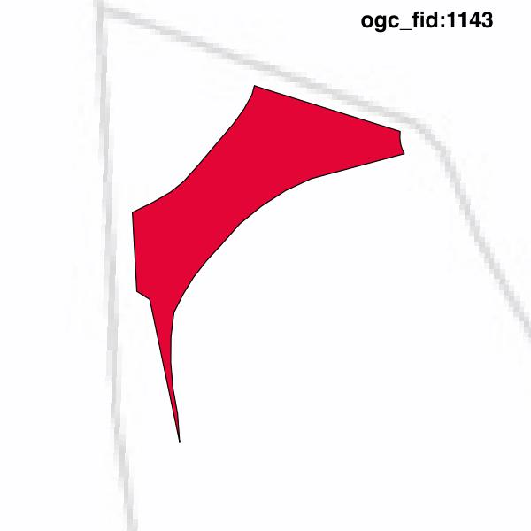

#Report on feature with OGC_FID=1143
##Original geometry

| ogc_fid |  beregnet_areal  | antal_punkter | antal_geometrier |    type    |
|---------|------------------|---------------|------------------|------------|
|    1143 | 34.7732335824508 |            43 |                1 | ST_Polygon|

##Geometry with buffer 0

| ogc_fid |  beregnet_areal  | antal_punkter | antal_geometrier |    type    |
|---------|------------------|---------------|------------------|------------|
|    1143 | 34.7732335824508 |            41 |                1 | ST_Polygon|

