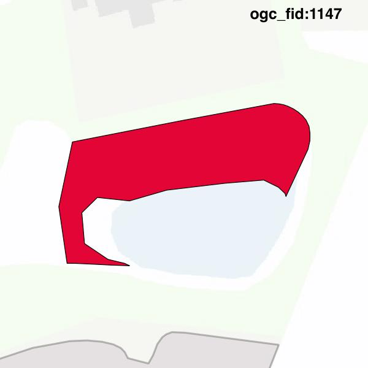

#Report on feature with OGC_FID=1147
##Original geometry

| ogc_fid |  beregnet_areal  | antal_punkter | antal_geometrier |      type       |
|---------|------------------|---------------|------------------|-----------------|
|    1147 | 834.454677558886 |            39 |                3 | ST_MultiPolygon|

[highres](https://raw.githubusercontent.com/Septima/herlev/master/images/1147_invalid_highres.jpg)
##Geometry with buffer 0

| ogc_fid |  beregnet_areal  | antal_punkter | antal_geometrier |    type    |
|---------|------------------|---------------|------------------|------------|
|    1147 | 834.454677558886 |            33 |                1 | ST_Polygon|

[highres](https://raw.githubusercontent.com/Septima/herlev/master/images/1147_buffer0_highres.jpg)
