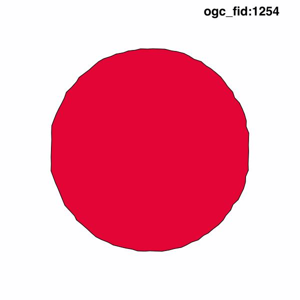

#Report on feature with OGC_FID=1254
##Original geometry

| ogc_fid |  beregnet_areal  | antal_punkter | antal_geometrier |    type    |
|---------|------------------|---------------|------------------|------------|
|    1254 | 12.4347171298348 |           104 |                1 | ST_Polygon|

[highres](https://raw.githubusercontent.com/Septima/herlev/master/images/1254_invalid.jpg)
##Geometry with buffer 0

| ogc_fid |  beregnet_areal  | antal_punkter | antal_geometrier |    type    |
|---------|------------------|---------------|------------------|------------|
|    1254 | 12.4347171298349 |           102 |                1 | ST_Polygon|

[highres](https://raw.githubusercontent.com/Septima/herlev/master/images/1254_buffer0_highres.jpg)
