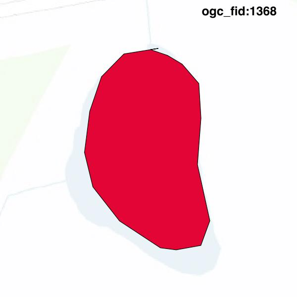
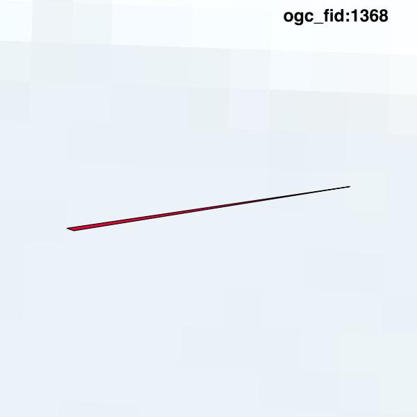

#Report on feature with OGC_FID=1368
##Original geometry

| ogc_fid |  beregnet_areal  | antal_punkter | antal_geometrier |    type    |
|---------|------------------|---------------|------------------|------------|
|    1368 | 637.294288221769 |            18 |                1 | ST_Polygon|

[highres](https://raw.githubusercontent.com/Septima/herlev/master/images/1368_invalid_highres.jpg)
##Geometry with buffer 0

| ogc_fid |   beregnet_areal   | antal_punkter | antal_geometrier |    type    |
|---------|--------------------|---------------|------------------|------------|
|    1368 | 0.0124403000685706 |             4 |                1 | ST_Polygon|

[highres](https://raw.githubusercontent.com/Septima/herlev/master/images/1368_buffer0_highres.jpg)
