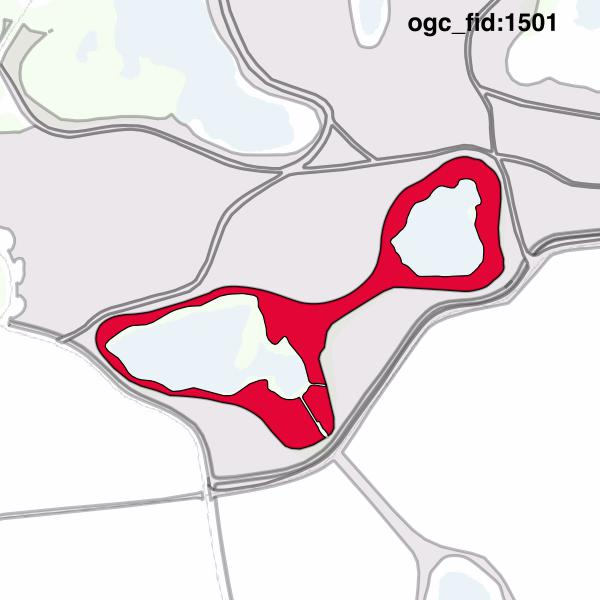

#Report on feature with OGC_FID=1501
##Original geometry

| ogc_fid |  beregnet_areal  | antal_punkter | antal_geometrier |    type    |
|---------|------------------|---------------|------------------|------------|
|    1501 | 5155.47302213086 |           493 |                1 | ST_Polygon|

##Geometry with buffer 0

| ogc_fid |  beregnet_areal  | antal_punkter | antal_geometrier |      type       |
|---------|------------------|---------------|------------------|-----------------|
|    1501 | 5155.47302213085 |           486 |                2 | ST_MultiPolygon|

