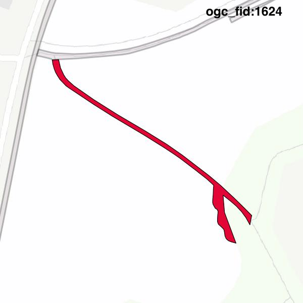

#Report on feature with OGC_FID=1624
##Original geometry

| ogc_fid | beregnet_areal  | antal_punkter | antal_geometrier |    type    |
|---------|-----------------|---------------|------------------|------------|
|    1624 | 218.62197381758 |            72 |                1 | ST_Polygon|

[highres](https://raw.githubusercontent.com/Septima/herlev/master/images/1624_invalid_highres.jpg)
##Geometry with buffer 0

| ogc_fid | beregnet_areal  | antal_punkter | antal_geometrier |    type    |
|---------|-----------------|---------------|------------------|------------|
|    1624 | 218.62197381758 |            70 |                1 | ST_Polygon|

[highres](https://raw.githubusercontent.com/Septima/herlev/master/images/1624_buffer0_highres.jpg)
