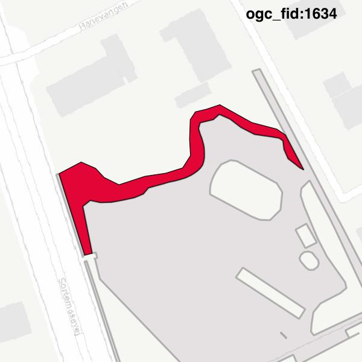

#Report on feature with OGC_FID=1634
##Original geometry

| ogc_fid |  beregnet_areal  | antal_punkter | antal_geometrier |    type    |
|---------|------------------|---------------|------------------|------------|
|    1634 | 383.556947916727 |            67 |                1 | ST_Polygon|

##Geometry with buffer 0

| ogc_fid |  beregnet_areal  | antal_punkter | antal_geometrier |    type    |
|---------|------------------|---------------|------------------|------------|
|    1634 | 383.557066398464 |            66 |                1 | ST_Polygon|

