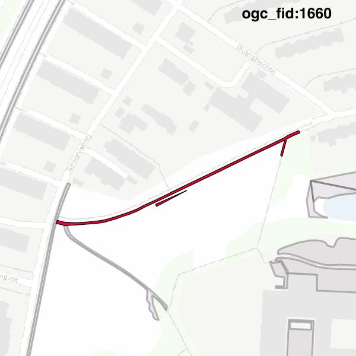
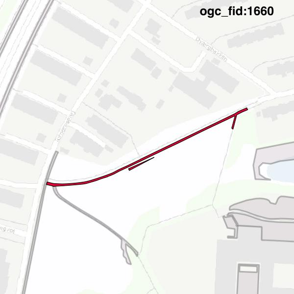

#Report on feature with OGC_FID=1660
##Original geometry

| ogc_fid |  beregnet_areal  | antal_punkter | antal_geometrier |      type       |
|---------|------------------|---------------|------------------|-----------------|
|    1660 | 345.884570835694 |            80 |                3 | ST_MultiPolygon|

[highres](https://raw.githubusercontent.com/Septima/herlev/master/images/1660_invalid.jpg)
##Geometry with buffer 0

| ogc_fid |  beregnet_areal  | antal_punkter | antal_geometrier |      type       |
|---------|------------------|---------------|------------------|-----------------|
|    1660 | 345.884570835694 |            76 |                3 | ST_MultiPolygon|

[highres](https://raw.githubusercontent.com/Septima/herlev/master/images/1660_buffer0_highres.jpg)
