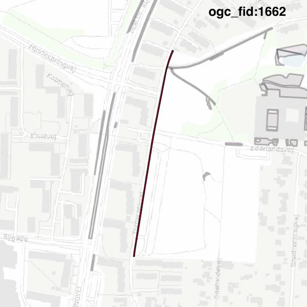
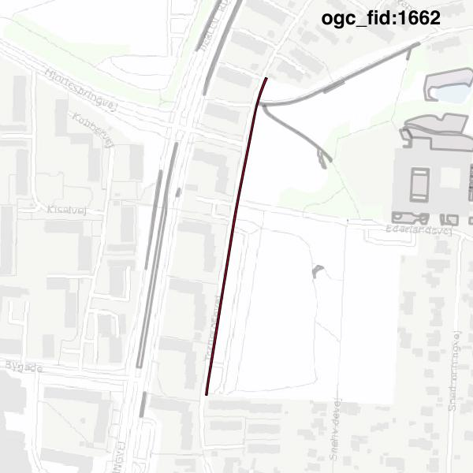

#Report on feature with OGC_FID=1662
##Original geometry

| ogc_fid | beregnet_areal  | antal_punkter | antal_geometrier |    type    |
|---------|-----------------|---------------|------------------|------------|
|    1662 | 626.15139071489 |            64 |                1 | ST_Polygon|

##Geometry with buffer 0

| ogc_fid | beregnet_areal  | antal_punkter | antal_geometrier |    type    |
|---------|-----------------|---------------|------------------|------------|
|    1662 | 626.15139071489 |            62 |                1 | ST_Polygon|

