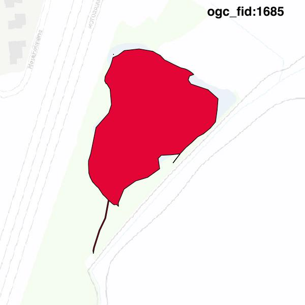

#Report on feature with OGC_FID=1685
##Original geometry

| ogc_fid | beregnet_areal  | antal_punkter | antal_geometrier |      type       |
|---------|-----------------|---------------|------------------|-----------------|
|    1685 | 7787.4105567038 |            93 |                2 | ST_MultiPolygon|

[highres](https://raw.githubusercontent.com/Septima/herlev/master/images/1685_invalid.jpg)
##Geometry with buffer 0

| ogc_fid | beregnet_areal  | antal_punkter | antal_geometrier |      type       |
|---------|-----------------|---------------|------------------|-----------------|
|    1685 | 7787.4105567038 |            94 |                3 | ST_MultiPolygon|

[highres](https://raw.githubusercontent.com/Septima/herlev/master/images/1685_buffer0_highres.jpg)
