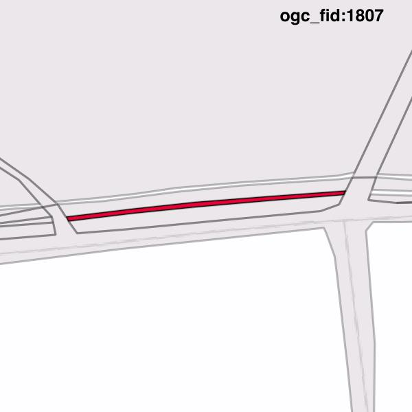
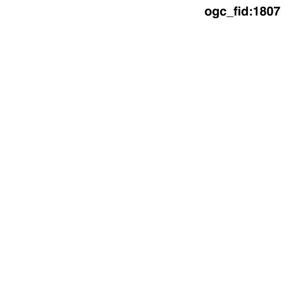

#Report on feature with OGC_FID=1807
##Original geometry

| ogc_fid | beregnet_areal  | antal_punkter | antal_geometrier |    type    |
|---------|-----------------|---------------|------------------|------------|
|    1807 | 28.578690731534 |            15 |                1 | ST_Polygon|

[highres](https://raw.githubusercontent.com/Septima/herlev/master/images/1807_invalid_highres.jpg)
##Geometry with buffer 0

| ogc_fid | beregnet_areal | antal_punkter | antal_geometrier |    type    |
|---------|----------------|---------------|------------------|------------|
|    1807 |              0 |             0 |                0 | ST_Polygon|

[highres](https://raw.githubusercontent.com/Septima/herlev/master/images/1807_buffer0_highres.jpg)
