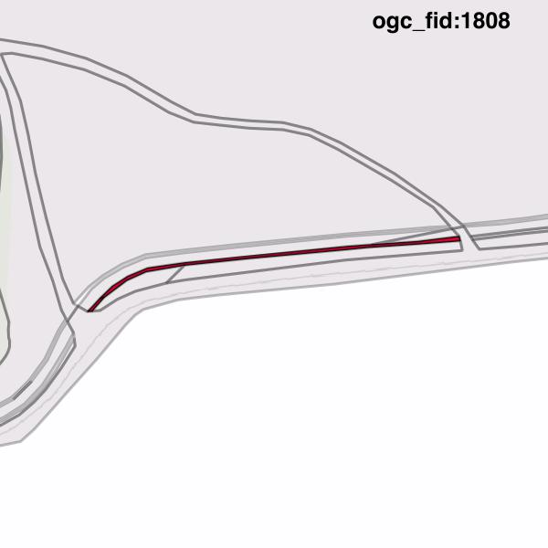
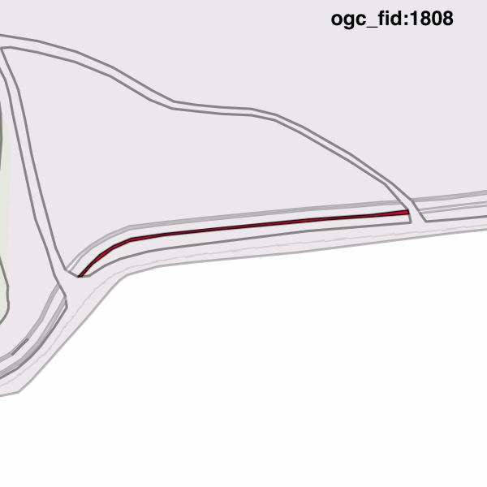

#Report on feature with OGC_FID=1808
##Original geometry

| ogc_fid |  beregnet_areal  | antal_punkter | antal_geometrier |      type       |
|---------|------------------|---------------|------------------|-----------------|
|    1808 | 42.8626155824224 |            27 |                2 | ST_MultiPolygon|

##Geometry with buffer 0

| ogc_fid |  beregnet_areal  | antal_punkter | antal_geometrier |    type    |
|---------|------------------|---------------|------------------|------------|
|    1808 | 42.8626155824224 |            24 |                1 | ST_Polygon|

