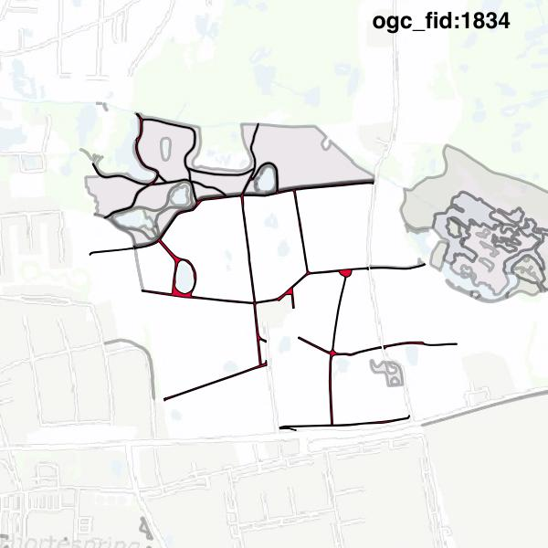

#Report on feature with OGC_FID=1834
##Original geometry

| ogc_fid | beregnet_areal  | antal_punkter | antal_geometrier |      type       |
|---------|-----------------|---------------|------------------|-----------------|
|    1834 | 19444.236687284 |          1593 |                9 | ST_MultiPolygon|

##Geometry with buffer 0

| ogc_fid |  beregnet_areal  | antal_punkter | antal_geometrier |      type       |
|---------|------------------|---------------|------------------|-----------------|
|    1834 | 19444.2366872841 |          1581 |                6 | ST_MultiPolygon|

