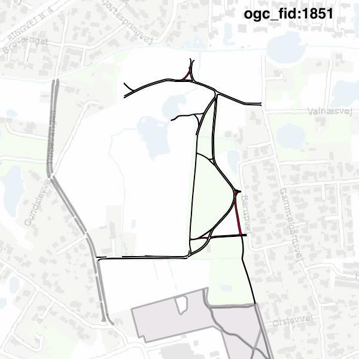

#Report on feature with OGC_FID=1851
##Original geometry

| ogc_fid | beregnet_areal  | antal_punkter | antal_geometrier |      type       |
|---------|-----------------|---------------|------------------|-----------------|
|    1851 | 3822.7195035166 |          1508 |               13 | ST_MultiPolygon|

##Geometry with buffer 0

| ogc_fid |  beregnet_areal  | antal_punkter | antal_geometrier |      type       |
|---------|------------------|---------------|------------------|-----------------|
|    1851 | 3822.71950351661 |          1505 |               12 | ST_MultiPolygon|

