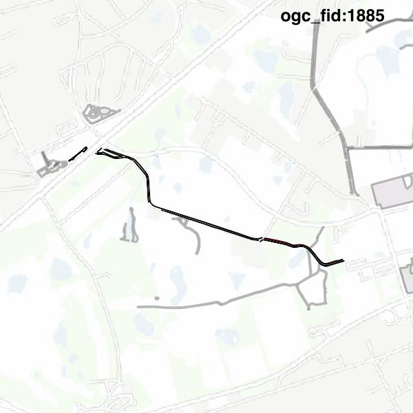

#Report on feature with OGC_FID=1885
##Original geometry

| ogc_fid | beregnet_areal  | antal_punkter | antal_geometrier |      type       |
|---------|-----------------|---------------|------------------|-----------------|
|    1885 | 2854.2641480833 |           540 |               15 | ST_MultiPolygon|

[highres](https://raw.githubusercontent.com/Septima/herlev/master/images/1885_invalid_highres.jpg)
##Geometry with buffer 0

| ogc_fid |  beregnet_areal  | antal_punkter | antal_geometrier |      type       |
|---------|------------------|---------------|------------------|-----------------|
|    1885 | 2854.26414808329 |           534 |               13 | ST_MultiPolygon|

[highres](https://raw.githubusercontent.com/Septima/herlev/master/images/1885_buffer0_highres.jpg)
