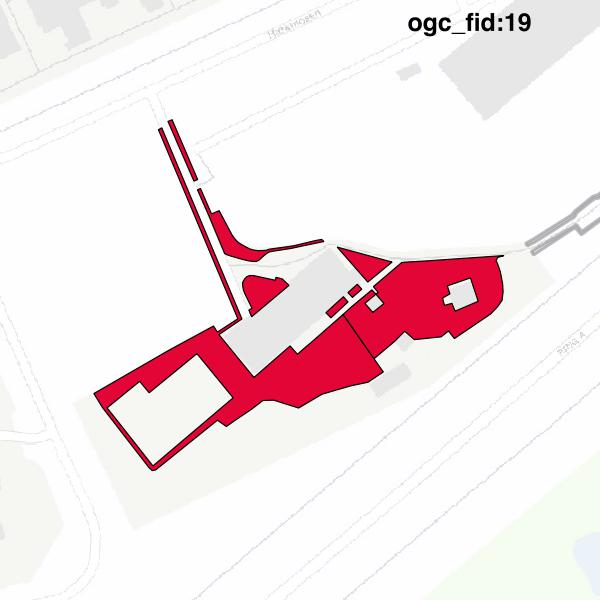

#Report on feature with OGC_FID=19
##Original geometry

| ogc_fid |  beregnet_areal  | antal_punkter | antal_geometrier |      type       |
|---------|------------------|---------------|------------------|-----------------|
|      19 | 1409.50901458372 |           164 |                8 | ST_MultiPolygon|

##Geometry with buffer 0

| ogc_fid |  beregnet_areal  | antal_punkter | antal_geometrier |      type       |
|---------|------------------|---------------|------------------|-----------------|
|      19 | 1409.50901458372 |           162 |                7 | ST_MultiPolygon|

