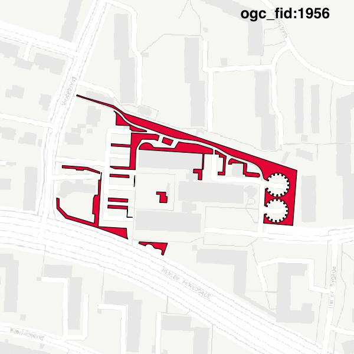

#Report on feature with OGC_FID=1956
##Original geometry

| ogc_fid | beregnet_areal  | antal_punkter | antal_geometrier |      type       |
|---------|-----------------|---------------|------------------|-----------------|
|    1956 | 3303.2825376481 |          2009 |               16 | ST_MultiPolygon|

##Geometry with buffer 0

| ogc_fid | beregnet_areal  | antal_punkter | antal_geometrier |      type       |
|---------|-----------------|---------------|------------------|-----------------|
|    1956 | 3303.2825376481 |          2010 |               17 | ST_MultiPolygon|

