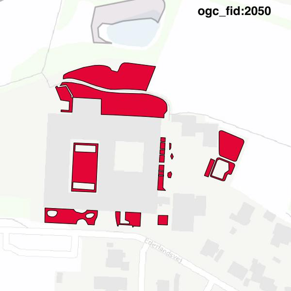

#Report on feature with OGC_FID=2050
##Original geometry

| ogc_fid |  beregnet_areal  | antal_punkter | antal_geometrier |      type       |
|---------|------------------|---------------|------------------|-----------------|
|    2050 | 3473.73129254863 |           366 |               17 | ST_MultiPolygon|

##Geometry with buffer 0

| ogc_fid |  beregnet_areal  | antal_punkter | antal_geometrier |      type       |
|---------|------------------|---------------|------------------|-----------------|
|    2050 | 3473.73129254863 |           368 |               20 | ST_MultiPolygon|

