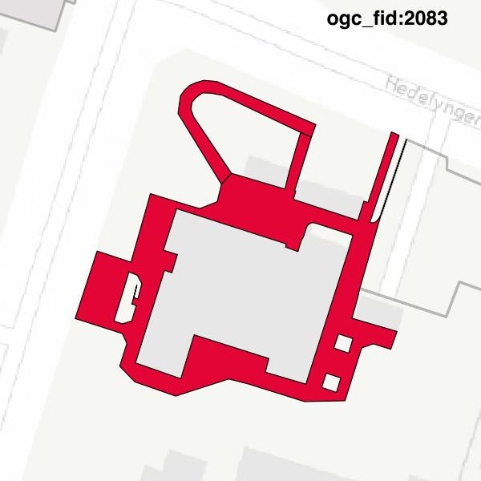
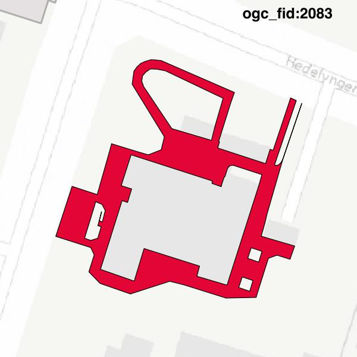

#Report on feature with OGC_FID=2083
##Original geometry

| ogc_fid |  beregnet_areal  | antal_punkter | antal_geometrier |      type       |
|---------|------------------|---------------|------------------|-----------------|
|    2083 | 463.574124493913 |           125 |                2 | ST_MultiPolygon|

[highres](https://raw.githubusercontent.com/Septima/herlev/master/images/2083_invalid.jpg)
##Geometry with buffer 0

| ogc_fid |  beregnet_areal  | antal_punkter | antal_geometrier |    type    |
|---------|------------------|---------------|------------------|------------|
|    2083 | 463.574124493913 |           121 |                1 | ST_Polygon|

[highres](https://raw.githubusercontent.com/Septima/herlev/master/images/2083_buffer0_highres.jpg)
