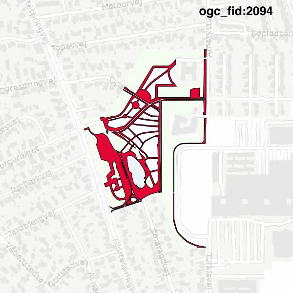

#Report on feature with OGC_FID=2094
##Original geometry

| ogc_fid |  beregnet_areal  | antal_punkter | antal_geometrier |      type       |
|---------|------------------|---------------|------------------|-----------------|
|    2094 | 20403.6060233631 |          1267 |               17 | ST_MultiPolygon|

[highres](https://raw.githubusercontent.com/Septima/herlev/master/images/2094_invalid.jpg)
##Geometry with buffer 0

| ogc_fid |  beregnet_areal  | antal_punkter | antal_geometrier |      type       |
|---------|------------------|---------------|------------------|-----------------|
|    2094 | 20403.6060233632 |          1268 |               18 | ST_MultiPolygon|

[highres](https://raw.githubusercontent.com/Septima/herlev/master/images/2094_buffer0_highres.jpg)
