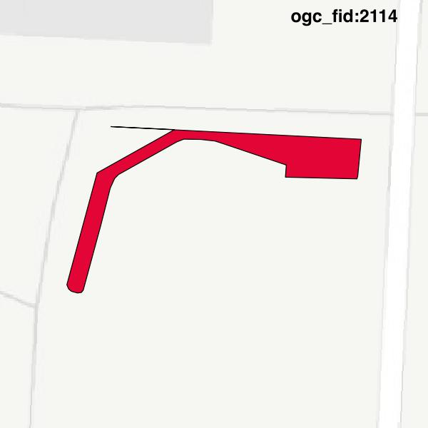
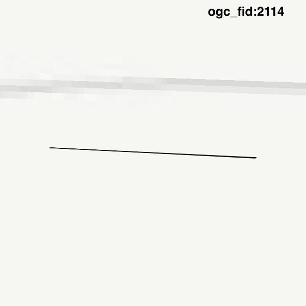

#Report on feature with OGC_FID=2114
##Original geometry

| ogc_fid | beregnet_areal  | antal_punkter | antal_geometrier |    type    |
|---------|-----------------|---------------|------------------|------------|
|    2114 | 80.308896394853 |            26 |                1 | ST_Polygon|

##Geometry with buffer 0

| ogc_fid |  beregnet_areal   | antal_punkter | antal_geometrier |    type    |
|---------|-------------------|---------------|------------------|------------|
|    2114 | 0.070539471235363 |             4 |                1 | ST_Polygon|

