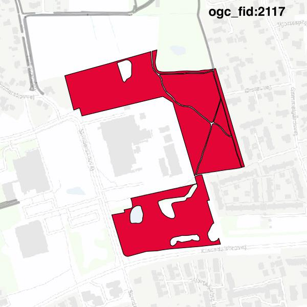

#Report on feature with OGC_FID=2117
##Original geometry

| ogc_fid |  beregnet_areal  | antal_punkter | antal_geometrier |      type       |
|---------|------------------|---------------|------------------|-----------------|
|    2117 | 51970.1682256295 |           438 |                6 | ST_MultiPolygon|

[highres](https://raw.githubusercontent.com/Septima/herlev/master/images/2117_invalid_highres.jpg)
##Geometry with buffer 0

| ogc_fid |  beregnet_areal  | antal_punkter | antal_geometrier |      type       |
|---------|------------------|---------------|------------------|-----------------|
|    2117 | 51970.1682256295 |           440 |                9 | ST_MultiPolygon|

[highres](https://raw.githubusercontent.com/Septima/herlev/master/images/2117_buffer0_highres.jpg)
