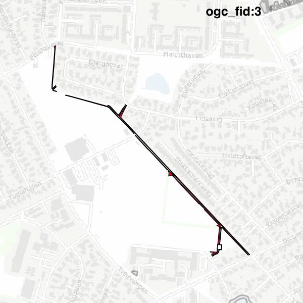

#Report on feature with OGC_FID=3
##Original geometry

| ogc_fid |  beregnet_areal  | antal_punkter | antal_geometrier |      type       |
|---------|------------------|---------------|------------------|-----------------|
|       3 | 3851.11035084104 |           393 |                8 | ST_MultiPolygon|

##Geometry with buffer 0

| ogc_fid |  beregnet_areal  | antal_punkter | antal_geometrier |      type       |
|---------|------------------|---------------|------------------|-----------------|
|       3 | 3851.96393839574 |           394 |                9 | ST_MultiPolygon|

