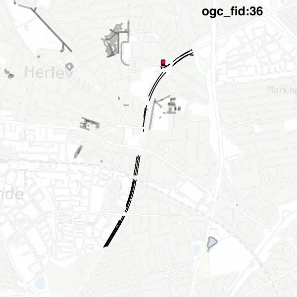

#Report on feature with OGC_FID=36
##Original geometry

| ogc_fid |  beregnet_areal  | antal_punkter | antal_geometrier |      type       |
|---------|------------------|---------------|------------------|-----------------|
|      36 | 13984.4357515384 |          1116 |               47 | ST_MultiPolygon|

##Geometry with buffer 0

| ogc_fid |  beregnet_areal  | antal_punkter | antal_geometrier |      type       |
|---------|------------------|---------------|------------------|-----------------|
|      36 | 13984.4357515384 |          1117 |               50 | ST_MultiPolygon|

