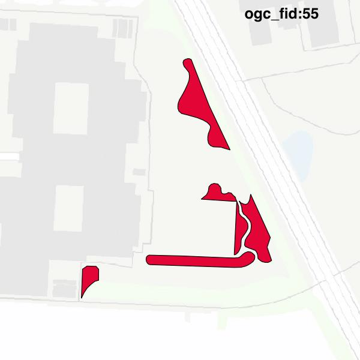

#Report on feature with OGC_FID=55
##Original geometry

| ogc_fid |  beregnet_areal  | antal_punkter | antal_geometrier |      type       |
|---------|------------------|---------------|------------------|-----------------|
|      55 | 1797.10531541985 |           172 |                5 | ST_MultiPolygon|

[highres](https://raw.githubusercontent.com/Septima/herlev/master/images/55_invalid.jpg)
##Geometry with buffer 0

| ogc_fid |  beregnet_areal  | antal_punkter | antal_geometrier |      type       |
|---------|------------------|---------------|------------------|-----------------|
|      55 | 1797.10531541986 |           173 |                6 | ST_MultiPolygon|

[highres](https://raw.githubusercontent.com/Septima/herlev/master/images/55_buffer0_highres.jpg)
