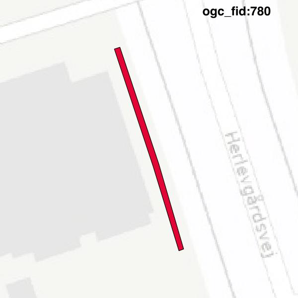

#Report on feature with OGC_FID=780
##Original geometry

| ogc_fid |  beregnet_areal  | antal_punkter | antal_geometrier |      type       |
|---------|------------------|---------------|------------------|-----------------|
|     780 | 22.9486259700139 |            10 |                2 | ST_MultiPolygon|

##Geometry with buffer 0

| ogc_fid |  beregnet_areal  | antal_punkter | antal_geometrier |    type    |
|---------|------------------|---------------|------------------|------------|
|     780 | 22.9486259700139 |             7 |                1 | ST_Polygon|

